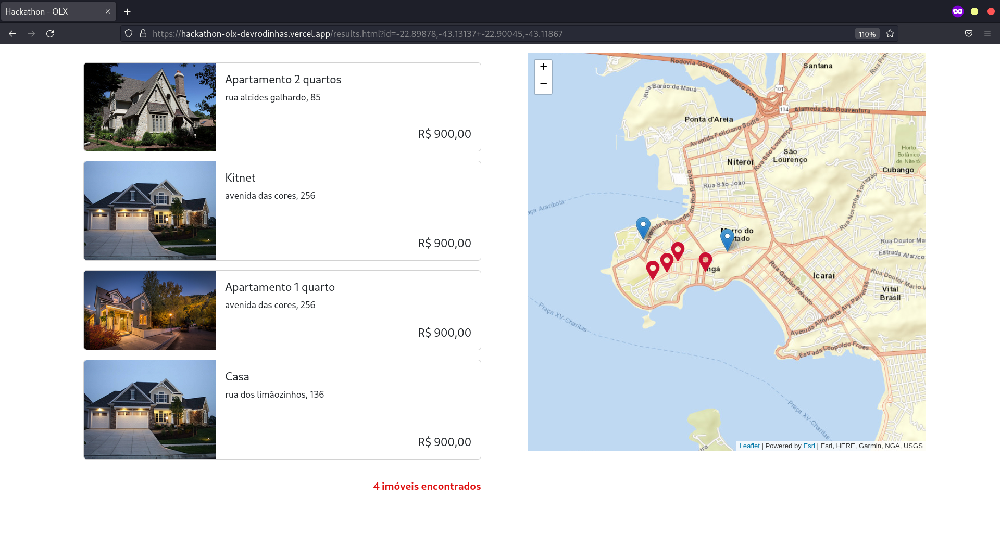

# HACKATHON OLX

Site protótipo de um mapa interativo, onde é permitido que o usuário selecione dois pontos, assim demarcando automaticamente um raio de busca de imóveis dentre as duas regiões.

## Tema
Proporcionar melhores resultados, através de uma experiência diferenciada e facilitadora para os usuários que anunciam, compram, vendem ou alugam imóveis nas plataformas da OLX Brasil: OLX, ZAP, Viva Real.

## Tecnologias
Tecnologias usadas no projeto:
* [Leaflet](https://leafletjs.com/)

## Desenvolvido por:
  - Gabriel Berto Breder
  - Alexsander Teixeira
  - Ana Beatriz Ferreira
  - Lucas Resende

## Exemplos
 
https://user-images.githubusercontent.com/62804393/194766440-77bd4140-e431-46c1-b3fc-2f03feea4076.mp4

