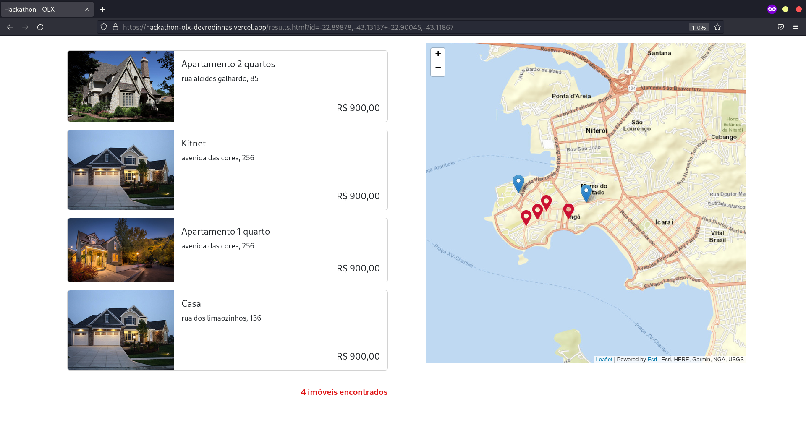

# HACKATHON OLX

Site protótipo de um mapa interativo, onde é permitido que o usuário adicione localizações e de acordo com as localidades selecionadas o script buscará os imóveis mais próximos entre o raio de busca do usuário e retornará para ele uma lista com tais imóveis.

## Tema
Proporcionar melhores resultados, através de uma experiência diferenciada e facilitadora para os usuários que anunciam, compram, vendem ou alugam imóveis nas plataformas da OLX Brasil: OLX, ZAP, Viva Real.

## Tecnologias
Tecnologias usadas no projeto:
* [Leaflet](https://leafletjs.com/)

## Desenvolvido por:
  - Gabriel Berto Breder
  - Alexsander Teixeira
  - Ana Beatriz Ferreira
  - Lucas Resende

## Exemplos

